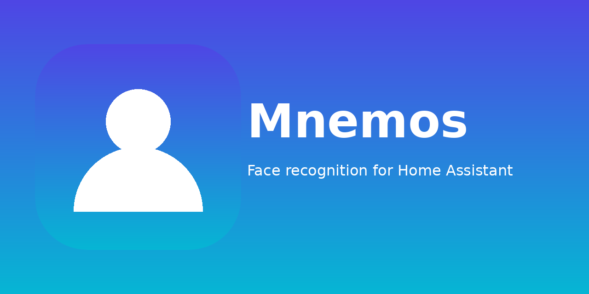

<p align="center">
  
</p>

<p align="center">
  <a href="https://github.com/vithurshan-selvarajah/ha-mnemos"></a>
  <a href="LICENSE"></a>
  <a href="https://hacs.xyz/"></a>
</p>

# Mnemos for Home Assistant

A HACS integration for [Mnemos](https://github.com/vithurshan-selvarajah/mnemos) — a local face-recognition backend. It lets you send a snapshot from Home Assistant to Mnemos and react to the identified person(s) in any automation.

> Pronounced **nee-MOZ** — the Greek goddess of memory.

---

## Features

- **`mnemos.identify` action** — send an image to Mnemos, from either a `camera.*` entity (latest still) or a local file path (e.g. a doorbell snapshot on `/share`). The action response is a slim `{persons, unknown, took_ms}` dict.
- **`binary_sensor.mnemos_<host>_reachable`** — true when the Mnemos backend reports `status: "ok"`.
- **`sensor.mnemos_<host>_model`** — currently active model with live reindex progress in the attributes.
- **`sensor.mnemos_<host>_last_identify`** — last identify result, with the full payload in the attributes for easy inspection in Developer Tools.
- Single config entry, identify-only API key is enough.

---

## Installation


### Via HACS (recommended)

1. Make sure [HACS](https://hacs.xyz/) is installed.
2. **HACS → Integrations → ⋮ → Custom repositories**, add:
   - Repository: `vithurshan-selvarajah/ha-mnemos`
   - Category: **Integration**
3. Search for **Mnemos** in HACS, install it.
4. Restart Home Assistant.

### Manual

1. Download or `git clone` this repository.
2. Copy `custom_components/mnemos/` into your HA `config/custom_components/` directory.
3. Restart Home Assistant.

---

## Configuration

1. **Settings → Devices & Services → + Add integration → Mnemos**.
2. Enter:
   - **Host** (default `mnemos-backend`) — use this if HA is on the same Docker network as the Mnemos stack. Use the LAN IP (e.g. `192.168.1.20`) for HAOS or a separate host.
   - **Port** (default `8000`).
   - **Use SSL** — enable if you've fronted Mnemos with TLS.
   - **API key** — an **Identify-Only** key from the Mnemos frontend (Settings → API Keys). Full-Admin keys also work but are not required.
3. The flow will hit `GET /healthz` to validate the connection and the key.

### Options

After setup, click **Configure** on the integration card to change:

- **Poll interval** for the health/model coordinator (default 30 s).
- **API key** rotation.

---

## `mnemos.identify` action

Send an image to Mnemos. The action returns the matches and unknown faces; read them with the `response_variable` pattern in an automation.

| Field | Type | Required | Description |
| --- | --- | --- | --- |
| `entity_id` | `camera.*` | one of | Latest still image from this camera. |
| `file_path` | string | one of | Absolute path to a JPEG/PNG on the HA host (e.g. `/share/snapshot.jpg`). |
| `timeout` | int (s) | no | Upload timeout (default 30). |

Exactly one of `entity_id` / `file_path` must be provided.

### Action response

The handler returns this dict. Inside an automation, capture it with `response_variable: <name>` and reference it as `<name>.persons[0].name`, etc.

```json
{
  "persons": [
    { "name": "Alice", "confidence": 0.91 }
  ],
  "unknown": false,
  "took_ms": 412
}
```

- `persons` — list of every face Mnemos matched, sorted by confidence (highest first). Empty list means no matches.
- `unknown` — `true` if Mnemos detected any face it couldn't match. Useful as a boolean trigger in automations.
- `took_ms` — how long the request took on the backend side (upload + detect + match).

---

## Examples

### Greet a known face at the door

```yaml
automation:
  - alias: "Greet known faces at the door"
    trigger:
      - platform: state
        entity_id: binary_sensor.front_door_motion
        to: "on"
    action:
      - alias: "Send snapshot to Mnemos and capture the response"
        response_variable: identify_result
        action: mnemos.identify
        data:
          entity_id: camera.front_door
      - if:
          - condition: template
            value_template: >
              {{ (identify_result.persons | default([])) | length > 0
                 and identify_result.persons[0].confidence > 0.75 }}
        then:
          - action: tts.speak
            data:
              media_player_entity_id: tts.living_room
              message: >-
                Welcome home, {{ identify_result.persons[0].name }}!
```

### Identify a doorbell snapshot from disk

```yaml
automation:
  - alias: "Identify doorbell snapshot"
    trigger:
      - platform: event
        event_type: ring_doorbell_snapshot_saved
    action:
      - response_variable: identify_result
        action: mnemos.identify
        data:
          file_path: "{{ trigger.event.data.path }}"
```

### Skip automation when the backend is down

```yaml
automation:
  - alias: "Don't try to identify if Mnemos is down"
    trigger:
      - platform: state
        entity_id: binary_sensor.mnemos_<host>_reachable
        to: "off"
        for: minutes: 2
    action:
      - service: notify.mobile_app
        data:
          title: "Mnemos unreachable"
          message: "Face recognition is offline — check the backend."
```

### Watch reindex progress

```yaml
sensor:
  - platform: template
    sensors:
      mnemos_reindex_percent:
        friendly_name: "Mnemos reindex progress"
        unit_of_measurement: "%"
        value_template: >-
          {{ state_attr('sensor.mnemos_<host>_model', 'reindex_percent') | default(0) | round(0) }}
```

---

## Troubleshooting

- **Config flow fails: 401 Unauthorized** — your API key is wrong or revoked. Re-create it in the Mnemos frontend.
- **Config flow fails: connection error** — check `host`/`port`. From the HA host's shell, `curl http://<host>:<port>/healthz` should respond.
- **`mnemos.identify` returns 0 matches and 0 unknowns** — the image has no detectable face, or every face is below `MNEMOS_MIN_FACE_PX`. Try a higher-quality still.
- **Need a custom threshold for a specific person?** That's per-person in the Mnemos frontend (People → person → custom threshold). This integration doesn't override it.

### Enable debug logging

```yaml
logger:
  default: warning
  logs:
    custom_components.mnemos: debug
```

---

## License

MIT — see [LICENSE](LICENSE).
